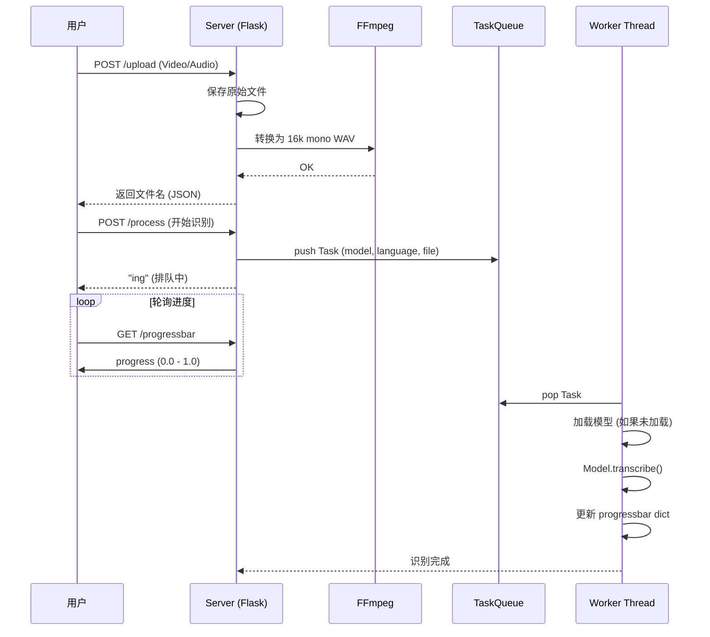

# STT-Dev 项目开发文档

本文档旨在帮助开发者从零开始了解、熟悉并精通 STT-Dev (Speech-to-Text) 项目。

## 1. 项目简介

STT-Dev 是一个基于 OpenAI `faster-whisper` 的本地语音转文字 Web 应用。它提供了一个轻量级的 Web 界面用于上传音频/视频文件，并将其转换为字幕 (SRT, JSON, TXT)。项目后端采用 Flask + Gevent，支持异步任务队列处理，适合个人或小团体的本地部署使用。

**核心技术栈：**
- **Web 框架**: Flask (Python) + Gevent WSGI
- **核心算法**: 
  - Faster-Whisper (基于 CTranslate2，适用于 CPU/CUDA)
  - MLX-Whisper (基于 Apple MLX，适用于 Apple Silicon M1/M2/M3/M4)
- **依赖库**: PyTorch, FFmpeg
- **前端**: HTML/JS (Jinja2 Templates)

---

## 2. 架构概览

### 2.1 系统架构图

```mermaid
graph TD
    User[用户 (Client)] -->|HTTP Upload| WebServer[Web Server (Flask/Gevent)]
    WebServer -->|保存文件| FileSys[(文件系统 tmp/)]
    WebServer -->|转换格式| FFmpeg[FFmpeg Wrapper]
    FFmpeg -->|生成的 WAV| FileSys
    
    WebServer -->|提交任务| TaskQueue[全局任务队列 (TASK_QUEUE)]
    
    subgraph "后台处理线程 (Worker)"
        Worker[Model Worker] -->|轮询| TaskQueue
        Worker -->|加载/调用| Model[Faster-Whisper 模型]
        Model -->|下载/读取| ModelFile[(models/ 目录)]
        Model -->|推理| GPU_CPU[GPU / CPU]
        GPU_CPU -->|返回结果| Worker
        Worker -->|更新状态| ProgressStore[内存状态存储]
    end
    
    User -->|轮询进度| WebServer
    WebServer -->|读取状态| ProgressStore
```

### 2.2 目录结构说明

```text
stt-dev/
├── start.py                # [入口] 主启动文件，包含 Web Server 和 Worker 线程逻辑
├── set.ini                 # [配置] 用户配置文件 (端口, 模型, 语言等)
├── requirements.txt        # python 依赖项
├── models/                 # [数据] 存放下载的 Whisper 模型文件
├── static/                 # [前端] 静态资源 (css, js, tmp临时文件)
│   └── tmp/                # 上传的音视频及转换后的 wav 文件
├── templates/              # [前端] HTML 模板 (index.html)
└── stslib/                 # [核心] 核心库目录
    ├── __init__.py
    ├── cfg.py              # 配置加载、全局变量 (TASK_QUEUE, 路径定义)
    └── tool.py             # 工具函数 (FFmpeg调用, 更新检查, 浏览器控制)
```

---

## 3. 入门指南 (Getting Started)

### 3.1 环境要求
- **操作系统**: macOS / Windows / Linux
- **Python**: 3.8+ (建议 3.10)
- **FFmpeg**: 必须安装并添加到系统环境变量 PATH 中 (Windows 下项目中自带了 ffmpeg 目录逻辑，Mac 需自行安装)。
- **GPU (可选)**: NVIDIA 显卡 + CUDA 环境 (推荐，能大幅提升速度)。

### 3.2 安装步骤

1.  **克隆/下载项目**
    ```bash
    git clone <repository_url>
    cd stt-dev
    ```

2.  **创建虚拟环境 (推荐)**
    ```bash
    python -m venv venv
    source venv/bin/activate  # Mac/Linux
    # venv\Scripts\activate   # Windows
    ```

3.  **安装依赖**
    ```bash
    pip install -r requirements.txt
    ```
    *注意：MacOS 用户若遇到 `opencc` 安装问题，可能需要 `brew install opencc` 或查看相关文档。*

4.  **安装 FFmpeg (Mac)**
    ```bash
    brew install ffmpeg
    ```

### 3.3 启动项目
运行以下命令启动服务：
```bash
python start.py
```
启动后，控制台会显示日志，默认浏览器会自动打开 `http://127.0.0.1:9977`。

---

## 4. 熟悉项目 (Familiarization)

### 4.1 核心业务流程
用户上传与转换流程如下：



### 4.2 配置文件详解 (`set.ini`)
项目通过 `set.ini` 控制行为，无需修改代码：
| 配置项 | 说明 | 默认值 |
| :--- | :--- | :--- |
| `web_address` | 服务监听地址 | 127.0.0.1:9977 |
| `devtype` | 推理设备：`cpu`、`cuda`、`mlx`(Apple Silicon)、`auto`(自动检测) | auto |
| `beam_size` | 束搜索大小，越大越准但越慢 | 5 |
| `best_of` | 候选采样数 | 5 |
| `vad` | 语音活动检测，`true` 过滤无声片段 | true |
| `model_list` | UI 显示的可选模型列表 | (众多模型名) |
| `opencc` | 简繁转换配置 (`t2s` 繁转简, `s2t` 简转繁) | t2s |

### 4.3 关键代码解析
- **`start.py: shibie()`**: 这是后台消费者线程。它死循环检查 `cfg.TASK_QUEUE`。
    - 如果队列为空，它会尝试卸载模型释放显存 (`torch.cuda.empty_cache`)。
    - 如果有任务，它会检查 `cfg.MODEL_DICT` 是否已有该模型，没有则加载。
    - 调用 `modelobj.transcribe` 进行识别，并实时更新 `cfg.progressbar`。
- **`stslib/cfg.py`**:
    - 初始化 `TMP_DIR`, `MODEL_DIR` 等路径。
    - 这里的 `parse_ini()` 函数负责读取配置文件，支持热加载（每次请求 index 或 process 时都会重新解析部分配置）。

---

## 5. 精通项目 (Mastery)

### 5.1 性能优化

#### Apple Silicon (M1/M2/M3/M4) 优化
如果你使用 Mac Mini M4 或其他 Apple Silicon 设备，项目已集成 **mlx-whisper** 进行加速：
1. 确保 `set.ini` 中 `devtype=auto` 或 `devtype=mlx`
2. 启动时应看到提示："已检测到 Apple Silicon，将使用 MLX 加速模式进行推理"
3. MLX 模式下，模型会自动从 Hugging Face Hub 下载 MLX 格式版本

> 性能参考：10 分钟音频使用 Medium 模型，在 M4 Mac Mini 上约 1.2 分钟完成。

#### 启用 CUDA (NVIDIA GPU)
1. 确保安装了正确版本的 PyTorch (带 CUDA 支持)。
2. 修改 `set.ini` 中 `devtype=cuda`。
3. 如果显存较小 (如 <4GB)，建议使用 `int8` 量化，或将 `beam_size` 设为 1。

- **模型预热**: 首次请求模型需要加载时间。可以将常用模型在启动时预加载（需修改 `start.py`）。

### 5.2 API 接口开发 (OpenAI 兼容)
项目内置了一个兼容 OpenAI Whisper API 的接口 `/v1/audio/transcriptions`。
这意味着你可以使用现有的 OpenAI 客户端库来调用本服务：

```python
from openai import OpenAI

client = OpenAI(api_key='any', base_url='http://127.0.0.1:9977/v1')
audio_file = open("speech.wav", "rb")
transcription = client.audio.transcriptions.create(
  model="small", 
  file=audio_file,
  response_format="text"
)
print(transcription.text)
```
这使得该项目可以作为其他 AI 应用的本地语音识别后端。

### 5.3 常见问题排除 (Troubleshooting)
- **FFmpeg 报错**: 确保在终端能直接运行 `ffmpeg -version`。
- **模型下载慢**: 项目默认配置了 `HF_ENDPOINT` 为 `https://hf-mirror.com` (在 `cfg.py` 中)，专为国内网络优化。
- **内存泄漏**: 注意 `TASK_QUEUE` 为空时的显存释放逻辑 (`shibie` 函数中)。如果发现显存不释放，检查是否有僵尸线程。

### 5.4 扩展方向
1.  **多卡并行**: 目前代码设计为单 Worker (`shibie` 只有一个线程)。若要支持高并发，可将 `TASK_QUEUE` 处理逻辑改为多线程或多进程，并管理多个模型实例。
2.  **WebSocket 推送**: 目前进度查询是轮询 (Polling)，可改为 WebSocket 实时推送进度。
