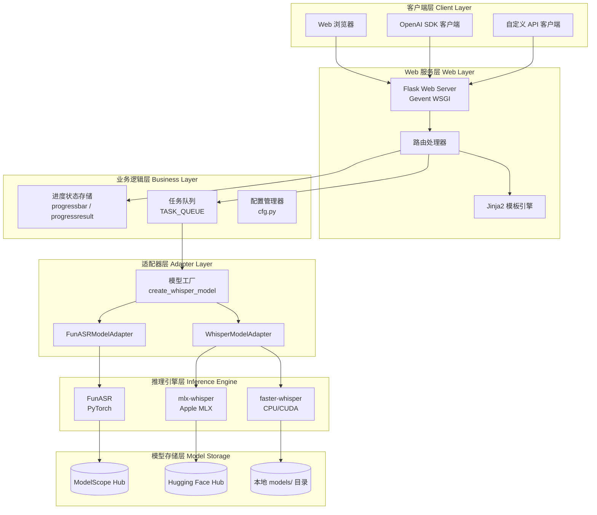
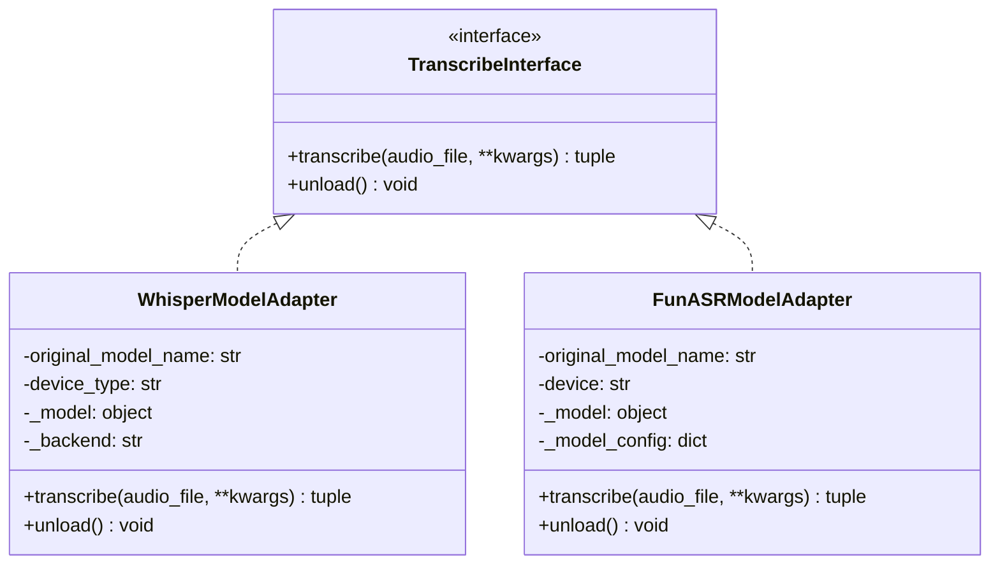
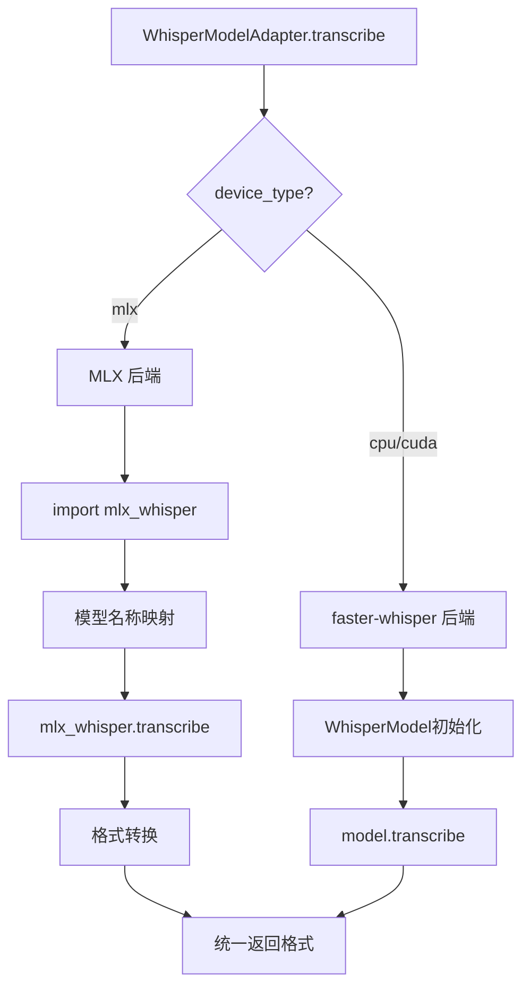
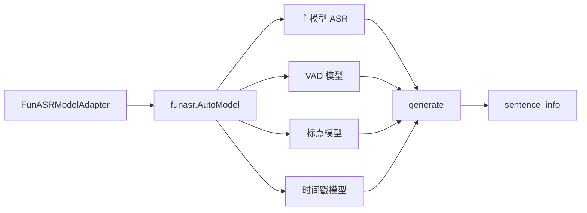
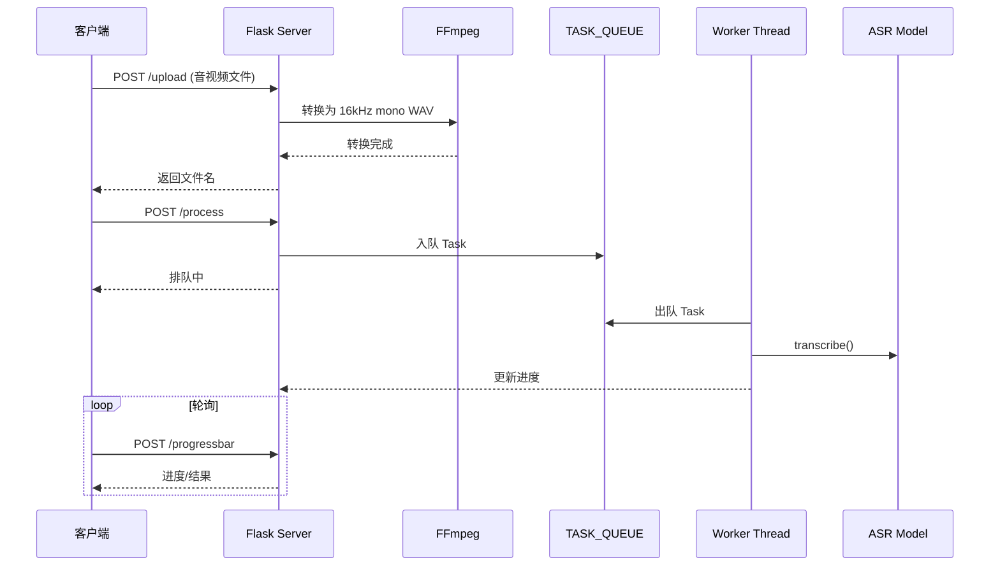
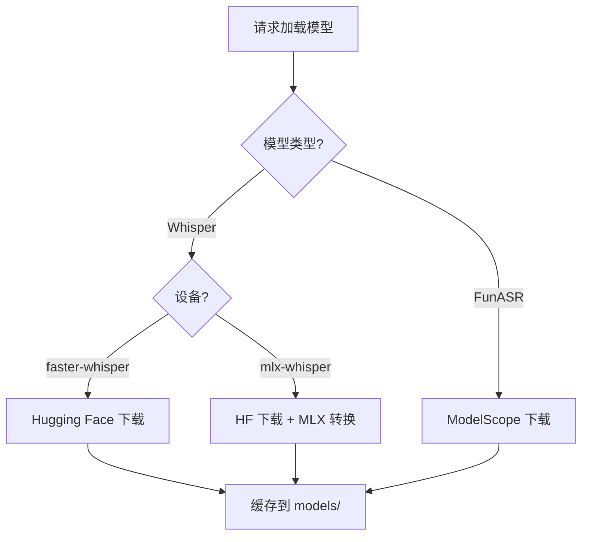

# STT-Dev 项目技术原理与方案详解

## 一、项目概述

### 1.1 项目定位

**STT-Dev** (Speech-To-Text Development) 是一个**本地化离线运行**的语音识别转文字 Web 应用系统。它基于多种开源语音识别引擎（Whisper、FunASR），提供统一的 API 接口和 Web 界面，将音频/视频文件转换为结构化的字幕文本。

### 1.2 核心特性

| 特性 | 描述 |
|------|------|
| **多后端支持** | 支持 `faster-whisper` (CPU/CUDA)、`mlx-whisper` (Apple Silicon)、`FunASR` (阿里达摩院) |
| **离线运行** | 模型下载后无需联网，保护数据隐私 |
| **OpenAI 兼容** | 提供与 OpenAI Whisper API 兼容的 REST 接口 |
| **多格式输出** | 支持 SRT 字幕、JSON、纯文本三种格式 |
| **简繁转换** | 内置 OpenCC 支持繁简体相互转换 |
| **自动设备检测** | 自动识别并使用最佳推理设备 (CUDA > MLX > CPU) |

### 1.3 技术栈

```
┌─────────────────────────────────────────────────────────────────────┐
│                           技术栈架构                                  │
├─────────────────────────────────────────────────────────────────────┤
│  前端层：HTML5 + Layui + Jinja2 模板                                 │
├─────────────────────────────────────────────────────────────────────┤
│  Web 框架：Flask + Gevent (异步 WSGI)                                │
├─────────────────────────────────────────────────────────────────────┤
│  业务逻辑：Python 3.9-3.12                                           │
├─────────────────────────────────────────────────────────────────────┤
│  推理引擎：                                                          │
│  ├── faster-whisper (CTranslate2) → CPU/CUDA                        │
│  ├── mlx-whisper (Apple MLX) → Apple Silicon                        │
│  └── FunASR (PyTorch) → 阿里语音模型                                 │
├─────────────────────────────────────────────────────────────────────┤
│  音频处理：FFmpeg (格式转换、采样率统一)                               │
├─────────────────────────────────────────────────────────────────────┤
│  深度学习框架：PyTorch + (可选) CUDA                                  │
└─────────────────────────────────────────────────────────────────────┘
```

---

## 二、系统架构设计

### 2.1 整体架构图



### 2.2 目录结构详解

```
stt-dev/
├── start.py                    # 主入口：Web 服务 + 后台 Worker 线程
├── set.ini                     # 用户配置文件
├── version.json                # 版本信息
├── requirements.txt            # Python 依赖
│
├── stslib/                     # 核心库目录
│   ├── __init__.py             # 包初始化，定义 VERSION
│   ├── cfg.py                  # 全局配置：路径常量、任务队列、语言映射表
│   ├── tool.py                 # 工具函数：FFmpeg 调用、时间格式转换
│   ├── whisper_adapter.py      # Whisper 模型适配器 (统一封装)
│   ├── funasr_adapter.py       # FunASR 模型适配器
│   ├── funasr_model.py         # FunASR 自定义模型定义 (remote_code)
│   └── ctc.py                  # CTC 解码支持
│
├── models/                     # 模型存储目录
│   ├── models--Systran--*/     # faster-whisper 模型缓存
│   ├── models--openai--*/      # mlx-whisper 模型缓存
│   └── modelscope/             # FunASR ModelScope 模型缓存
│
├── static/                     # 静态资源
│   ├── layui/                  # Layui UI 框架
│   └── tmp/                    # 临时文件（上传的音视频、转换的 WAV）
│
└── templates/
    └── index.html              # 主页面模板
```

---

## 三、核心模块技术原理

### 3.1 模型适配器层 (Adapter Pattern)

项目采用 **适配器设计模式**，将不同的语音识别引擎封装为统一接口。

#### 3.1.1 类图



#### 3.1.2 工厂函数实现

```python
def create_whisper_model(model_name, device_type="auto", download_root=None):
    """
    创建语音识别模型实例的工厂函数
    自动检测模型类型并返回对应的适配器
    """
    if is_funasr_model(model_name):
        return FunASRModelAdapter(model_name, device_type, download_root)
    return WhisperModelAdapter(model_name, device_type, download_root)
```

#### 3.1.3 设备自动检测

```python
def get_optimal_device():
    """自动检测最佳设备类型"""
    if is_apple_silicon():      # macOS + ARM64
        return "mlx"
    if is_cuda_available():     # NVIDIA GPU + CUDA
        return "cuda"
    return "cpu"                # 回退到 CPU
```

### 3.2 Whisper 模型适配器

#### 3.2.1 多后端支持架构



#### 3.2.2 MLX 模型名称映射

```python
MLX_MODEL_MAP = {
    "tiny": "openai/whisper-tiny",
    "base": "openai/whisper-base",
    "small": "openai/whisper-small",
    "medium": "openai/whisper-medium",
    "large-v3": "openai/whisper-large-v3",
}
```

### 3.3 FunASR 模型适配器

#### 3.3.1 支持的 FunASR 模型

| 模型标识 | 实际模型 | 说明 |
|---------|---------|------|
| `fun-asr-nano` | FunAudioLLM/Fun-ASR-Nano-2512 | 31 种语言，中文优化 |
| `sensevoice-small` | iic/SenseVoiceSmall | 高精度多语言识别 |
| `paraformer-zh` | Paraformer Large | FunClip 同款，推荐用于字幕 |

#### 3.3.2 FunASR 集成架构



---

## 四、Web 服务层设计

### 4.1 路由设计

| 路由 | 方法 | 功能 |
|------|------|------|
| `/` | GET | 主页 |
| `/upload` | POST | 文件上传 |
| `/process` | POST | 提交识别任务 |
| `/progressbar` | POST | 查询进度 |
| `/api` | POST | 原生 API |
| `/v1/audio/transcriptions` | POST | OpenAI 兼容 API |

### 4.2 请求处理流程



### 4.3 任务队列设计

```python
# cfg.py 中定义全局状态
TASK_QUEUE = []           # 待处理任务队列
MODEL_DICT = {}           # 模型缓存
progressbar = {}          # 进度状态
progressresult = {}       # 结果存储
```

### 4.4 OpenAI 兼容 API

```python
from openai import OpenAI

client = OpenAI(api_key='any', base_url='http://127.0.0.1:9977/v1')
transcription = client.audio.transcriptions.create(
    model="small",
    file=open("speech.wav", "rb"),
    response_format="text"
)
print(transcription.text)
```

---

## 五、音频处理技术

### 5.1 FFmpeg 预处理

所有音视频统一转换为 **16kHz 单声道 WAV**：

```python
params = [
    "-i", input_file,
    "-ar", "16000",     # 采样率 16kHz
    "-ac", "1",         # 单声道
    output_file
]
```

### 5.2 VAD 语音活动检测

- **faster-whisper**: Silero VAD
- **FunASR**: fsmn-vad 模型

---

## 六、配置系统设计

### 6.1 配置项详解 (set.ini)

| 配置项 | 类型 | 默认值 | 说明 |
|--------|------|--------|------|
| `web_address` | string | 127.0.0.1:9977 | 服务监听地址 |
| `devtype` | enum | auto | 推理设备 |
| `beam_size` | int | 5 | 束搜索大小 |
| `vad` | bool | true | VAD 开关 |
| `opencc` | string | t2s | 简繁转换 |
| `model_list` | list | ... | 模型列表 |

---

## 七、输出格式设计

| 格式 | 说明 | 示例 |
|------|------|------|
| **srt** | SRT 字幕 | `1\n00:00:00,000 --> 00:00:05,000\n你好\n` |
| **json** | 结构化 | `[{"line":1,"start_time":"...","text":"你好"}]` |
| **text** | 纯文本 | `你好 世界` |

---

## 八、模型管理策略

### 8.1 模型下载与缓存



### 8.2 模型生命周期

```python
# 队列空闲时释放显存
if len(cfg.TASK_QUEUE) < 1:
    for key in cfg.MODEL_DICT:
        cfg.MODEL_DICT[key] = None
    torch.cuda.empty_cache()
```

---

## 九、性能优化方案

### 9.1 推理加速策略

| 策略 | 适用场景 | 配置 |
|------|----------|------|
| **MLX 加速** | Apple Silicon | `devtype=mlx` |
| **CUDA 加速** | NVIDIA GPU | `devtype=cuda` |
| **VAD 过滤** | 长音频 | `vad=true` |
| **降低 beam_size** | 速度优先 | `beam_size=1` |

### 9.2 内存管理

- 空闲释放模型
- 禁用前文依赖 (`condition_on_previous_text=false`)
- 贪婪解码 (`temperature=0`)

---

## 十、扩展开发指南

### 10.1 添加新后端

1. 创建适配器类实现 `transcribe()` 和 `unload()`
2. 更新工厂函数 `create_whisper_model()`
3. 更新 `set.ini` 的 `model_list`

### 10.2 添加新输出格式

在 `_api_process()` 中添加格式处理分支。

---

## 十一、总结

### 架构优势

1. **模块化设计**: 适配器模式统一接口
2. **设备自适应**: 自动检测最佳设备
3. **API 兼容性**: 支持 OpenAI SDK
4. **离线运行**: 保护数据隐私

### 技术亮点

- 多引擎融合 (Whisper + FunASR)
- 跨平台加速 (CUDA / MLX / CPU)
- 模型缓存自动修复
- Monkey Patch 兼容性修复

### 未来演进

1. WebSocket 实时推送
2. 多 Worker 并行
3. 流式转录
4. 模型量化 (INT8/INT4)
